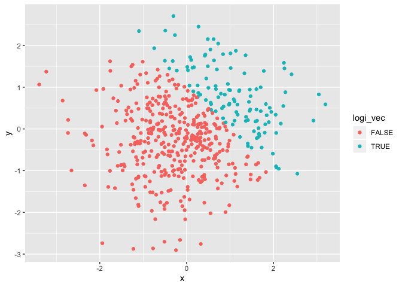
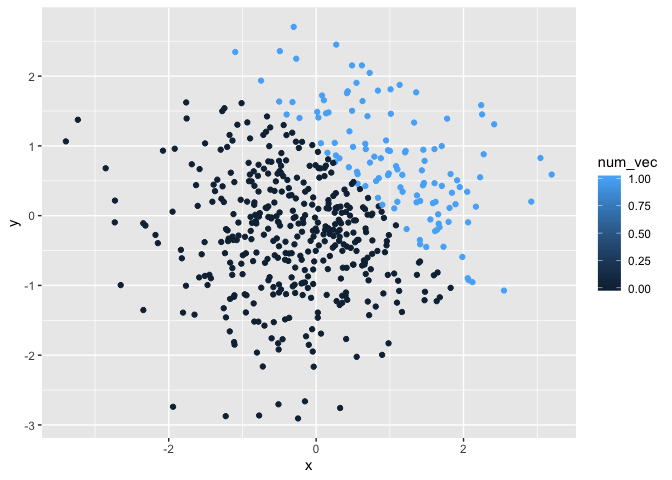

p8105\_hw1\_jf3285
================
Jiarui Fu
2019-09-20

## Problem 1

The purpose of this problem is to address variable types and introduce
coercion. <br />Create a data frame comprised of: a random sample of
size 8 from a standard Normal distribution, a logical vector indicating
whether elements of the sample are greater than 0, a character vector of
length , a factor vector of length 8, with 3 different factor “levels”.

``` r
# set seed to ensure reproducibility
set.seed(1234)

# create data frame
create_df = tibble(
  x = rnorm(8),
  vec_logical = x > 0,
  vec_char = c("My", "name", "is", "Alexa", "Hello", "Hey", "Hi","Bye"),
  vec_factor = factor(c("low", "medium", "high", "high", "medium", "low", "medium", "medium"))
)

# calculate the mean of each variable
# numeric and logical vectors work but character and factor vectors return NA
x_mean = mean(pull(create_df, x))
vec_logical_mean = mean(pull(create_df, vec_logical))
# vec_char_mean = mean(vec_char)
# vec_factor_mean = mean(vec_factor)

as.numeric(pull(create_df, vec_logical))
```

    ## [1] 0 1 1 0 1 1 0 0

``` r
# as numeric(character vector) returns NA
as.numeric(pull(create_df, vec_char))
```

    ## Warning: NAs introduced by coercion

    ## [1] NA NA NA NA NA NA NA NA

``` r
as.numeric(pull(create_df, vec_factor))
```

    ## [1] 2 3 1 1 3 2 3 3

This part of code chunk converts logical vectors to numeric and factor
vectors.

``` r
# logical vectors convert to numeric and factor vectors
convert_logi_numeric = as.numeric(pull(create_df, vec_logical))
result1 = convert_logi_numeric*(pull(create_df, x))
result1
```

    ## [1] 0.0000000 0.2774292 1.0844412 0.0000000 0.4291247 0.5060559 0.0000000
    ## [8] 0.0000000

``` r
convert_logi_factor = as.factor(pull(create_df, vec_logical))
result2 = convert_logi_factor*(pull(create_df, x))
```

    ## Warning in Ops.factor(convert_logi_factor, (pull(create_df, x))): '*' not
    ## meaningful for factors

``` r
result2
```

    ## [1] NA NA NA NA NA NA NA NA

``` r
double_convert = as.numeric(convert_logi_factor)
result3 = double_convert*(pull(create_df, x))
result3
```

    ## [1] -1.2070657  0.5548585  2.1688824 -2.3456977  0.8582494  1.0121118
    ## [7] -0.5747400 -0.5466319

## Problem 2

This problem focuses on the use of inline R code and plotting.

``` r
set.seed(1234)

# create data frame
plot_df = tibble(
  x = rnorm(500),
  y = rnorm(500),
  logi_vec = c(x+y) > 1,
  num_vec = as.numeric(logi_vec),
  factor_vec = as.factor(logi_vec)
)

# make and export scatterplot
ggplot(plot_df, aes(x=x, y=y, color=logi_vec)) + geom_point()
```

<!-- -->

``` r
ggsave("scatter plot.pdf", height = 4, width = 6)
ggplot(plot_df, aes(x=x, y=y, color=num_vec)) + geom_point()
```

<!-- -->

``` r
ggplot(plot_df, aes(x=x, y=y, color=factor_vec)) + geom_point()
```

<!-- -->

# Description of vectors using inline R code

The size of the dataset is 500 and 5.

The mean of x is 0.0018388.

The median of x is -0.0207073.

The standard deviation of x is 1.0348139.

The proportion of cases for which x + y \> 1 is 0.232
